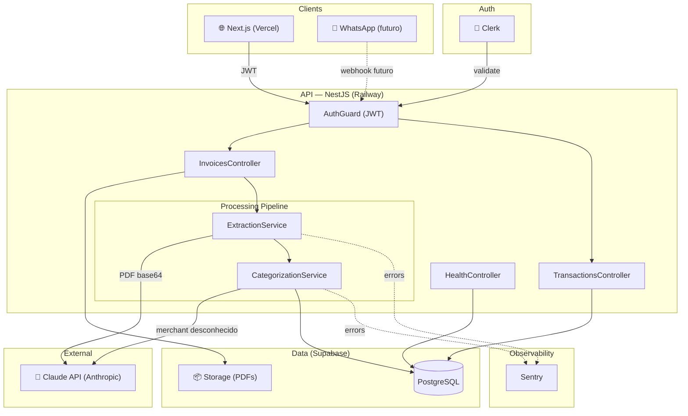
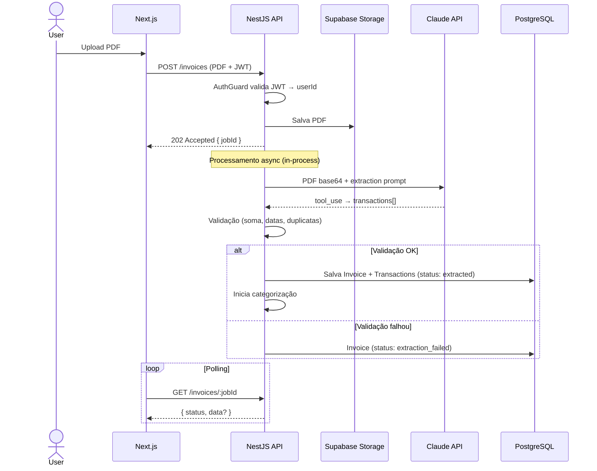
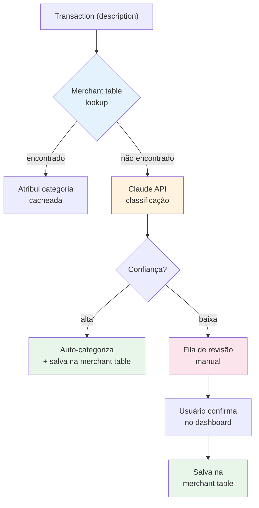
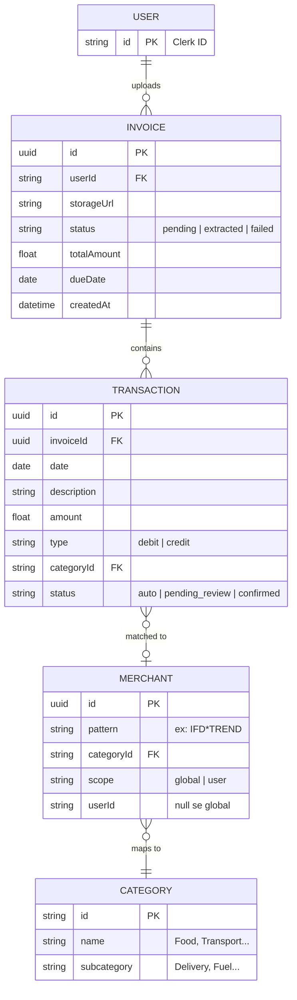
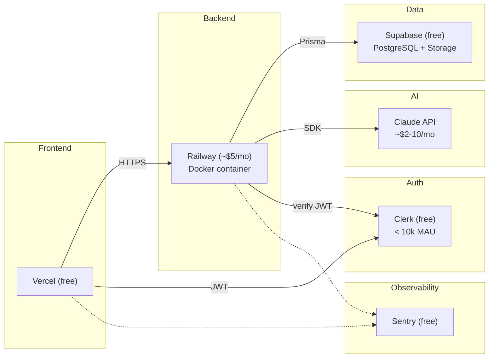
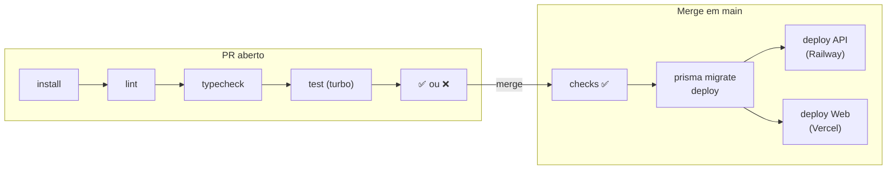
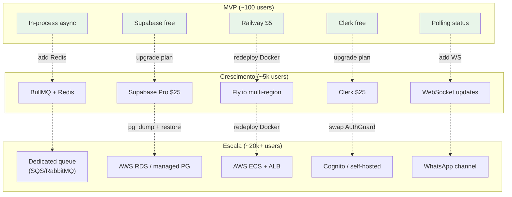

# System Design — Luppa (MVP ~100 users)

## 1. Visão geral

---

## 2. Fluxo de upload de fatura

---

## 3. Fluxo de categorização

---

## 4. Modelo de dados

---

## 5. Infraestrutura MVP

**Custo total: ~$7–15/mês**

---

## 6. CI/CD Pipeline

---

## 7. Pontos de evolução

---

## 8. Limites e decisões-chave

| Decisão | Escolha MVP | Por quê | Quando muda |
|---|---|---|---|
| Fila de jobs | In-process async | Simples, sem infra extra | Volume > timeout de request |
| Multi-tenancy | Row-level (userId) | Suficiente, sem overhead | Nunca (padrão escalável) |
| Auth | Clerk JWT | Zero código de auth | > 10k MAU |
| Extração | Claude API direta | Melhor acurácia, zero parsers | Se custo LLM explodir |
| Categorização | Merchant table + LLM | LLM calls diminuem com tempo | Merchant table cobre 90%+ |
| Storage | Supabase Storage | Free, integrado | > 1GB de PDFs |
| Migrations | Prisma no CI | Automático, sem manual | Nunca (padrão correto) |
| Observability | Sentry apenas | Suficiente pro tamanho | Adicionar APM quando necessário |
